# 🏀 ShootPointer Backend

ShootPointer는 농구 영상을 업로드하면 개인 하이라이트를 생성하고, 생성된 결과를 커뮤니티 게시글과 랭킹으로 연결하는 서비스입니다.


- 이 서비스가 어떤 문제를 해결하려는지
- 요청이 들어왔을 때 백엔드 내부에서 어떤 계층과 저장소를 거치는지
- 외부 OpenCV 서버와 어떻게 협업하는지
- 좋아요/랭킹/검색/실시간 진행률 같은 핵심 기능이 어떻게 동작하는지


## 📚 목차

- [🚀 프로젝트 한눈에 보기](#overview)
- [🗺️ 서비스 전체 흐름](#system-flow)
- [🧰 기술 스택과 저장소 역할](#tech-stack)
- [🏗️ 백엔드 처리 구조](#backend-architecture)
- [🔍 상세 기능 설명](#feature-details)
- [🗃️ 데이터 모델](#data-model)
- [⚙️ 운영 / 배포 / CI](#operations)
- [✅ 테스트와 품질 관리](#testing)
- [🧱 멀티모듈 리팩터링](#refactoring)


<a id="overview"></a>
## 🚀 1. 프로젝트 한눈에 보기

### 1-1. 서비스가 해결하려는 문제

농구 영상 서비스에서 사용자는 보통 다음 문제를 겪습니다.

- 경기 영상을 올려도 원하는 장면만 다시 보기 어렵다.
- 내 플레이만 모아서 소비하기 어렵다.
- 콘텐츠가 영상 파일에 머무르고 커뮤니티 활동으로 잘 이어지지 않는다.
- 단순 저장이 아니라 "검색", "랭킹", "실시간 상태 확인"까지 이어져야 UX가 좋아진다.

ShootPointer는 이 문제를 아래 흐름으로 풀고자 했습니다.

- 카카오 로그인으로 회원 식별
- 등번호 등록으로 OpenCV 서버가 사용자를 인식할 기준 확보
- 영상 업로드 권한을 백엔드가 발급
- OpenCV 서버가 개인 하이라이트를 생성
- 생성 진행률을 실시간으로 전달
- 완성된 하이라이트를 게시글, 좋아요, 댓글, 랭킹으로 확장

### 1-2. 서비스 전체 비즈니스 흐름

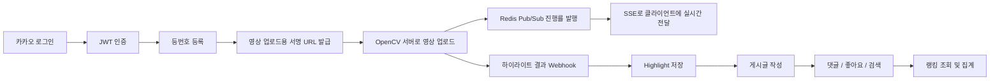

### 1-3. 이 레포지토리에서 확인할 수 있는 백엔드 역량

- OAuth2 소셜 로그인과 JWT 기반 인증/인가
- 외부 OpenCV 서버와의 HTTP 연동
- Redis Pub/Sub + SSE 기반 실시간 상태 전달
- PostgreSQL / Redis / Elasticsearch / MongoDB를 역할별로 분리한 설계
- JPA 중심의 도메인 로직과 Query 분리
- 좋아요 동시성 제어와 10,000건 동시성 테스트
- Docker Compose와 Jenkins 기반 운영 자동화
- Spring Modulith 기반 모듈 분리 리팩터링


<a id="system-flow"></a>
## 🗺️ 2. 서비스 전체 흐름

### 2-1. 시스템 컨텍스트

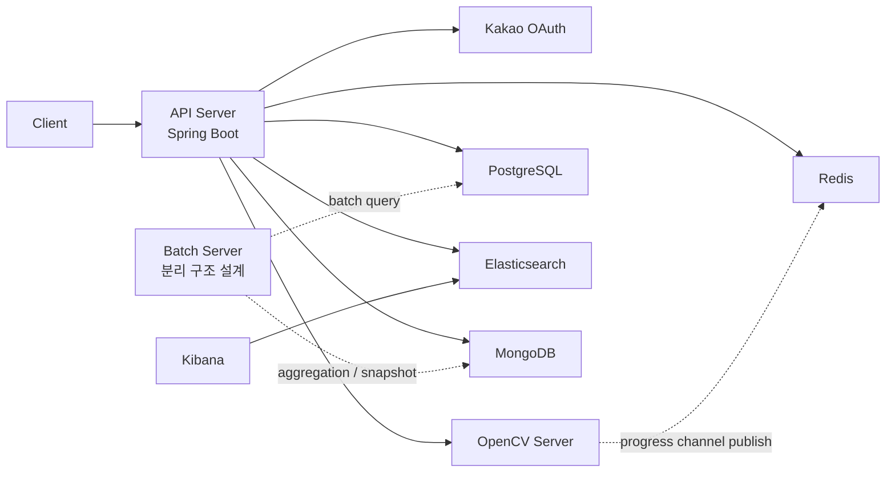

### 2-2. 핵심 저장소별 역할

| 저장소 | 역할 |
| --- | --- |
| PostgreSQL | 회원, 등번호, 하이라이트, 게시글, 댓글, 좋아요 등 운영 데이터 저장 |
| Redis | Refresh Token, 업로드 Job TTL, 랭킹 ZSet, OpenCV 진행률 Pub/Sub |
| Elasticsearch | 게시글 검색과 자동완성 |
| MongoDB | 기간별 랭킹 스냅샷 문서 저장 |

### 2-3. Redis 사용 목적 세분화

이 프로젝트에서 Redis는 단순 캐시가 아니라 4가지 역할을 합니다.

| 목적 | 사용 방식 |
| --- | --- |
| 인증 | `refresh:{email}` 형태로 Refresh Token 저장 |
| 업로드 추적 | `prefix + memberId`에 `jobId` 저장 |
| 실시간 이벤트 | OpenCV 진행률 Pub/Sub 채널 구독 |
| 랭킹 | ZSet 기반 주간/월간 현재 랭킹 저장 |

### 2-4. OpenCV 연동이 중요한 이유

이 백엔드는 파일을 직접 분석하지 않습니다.  
대신 OpenCV 서버와 역할을 분리해 아래처럼 협업합니다.

- 백엔드는 사용자 인증, 업로드 권한 발급, 결과 저장, 진행률 전달을 담당
- OpenCV 서버는 영상 처리, 개인 식별, 하이라이트 생성, 진행률 발행을 담당

즉, 이 서비스의 핵심은 "미디어 처리 자체"보다 "미디어 처리 서버와 안전하게 협업하는 백엔드 설계"에 있습니다.

<a id="tech-stack"></a>
## 🧰 3. 기술 스택과 저장소 역할

### 3-1. 기술 스택

| 분류 | 기술 |
| --- | --- |
| Language | Java 21 |
| Framework | Spring Boot 3.4.5 |
| Security | Spring Security, JWT, OAuth2 Client |
| ORM | Spring Data JPA |
| DB | PostgreSQL |
| Cache / Messaging | Redis, Redisson |
| Search | Elasticsearch |
| Document DB | MongoDB |
| Async / Client | WebClient, RestTemplate, SSE |
| Batch | Spring Batch |
| Docs | Swagger / OpenAPI |
| Test | JUnit5, Spring Boot Test, Testcontainers |
| Infra | Docker, Docker Compose, Jenkins, Azure |

### 3-2. 왜 저장소를 나눴는가

- 정합성이 중요한 운영 데이터는 PostgreSQL에 저장
- 빠른 토큰 저장과 이벤트 브로커 역할은 Redis에 위임
- 게시글 검색 품질은 Elasticsearch로 분리
- 과거 기간 랭킹 스냅샷은 MongoDB에 저장

즉, 한 DB에 다 몰아넣지 않고 "각 저장소의 강점"에 맞게 역할을 분리한 설계입니다.

<a id="backend-architecture"></a>
## 🏗️ 4. 백엔드 처리 구조

### 4-1. 공통 처리 계층

많은 도메인 기능이 아래 계층 구조를 반복합니다.

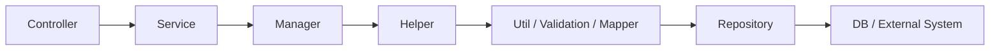

### 4-2. 각 계층의 역할

| 계층 | 역할 |
| --- | --- |
| Controller | HTTP 요청/응답, 파라미터 수집 |
| Service | 트랜잭션 시작점, 유즈케이스 위임 |
| Manager | 실제 비즈니스 흐름 조합 |
| Helper | Validation / Util 조합을 위한 중간 계층 |
| Util / Validation / Mapper | 조회, 저장, 검증, DTO-Entity 변환 |
| Repository | DB 접근 |

이 구조는 다소 레거시스럽지만, 책임을 쪼개서 테스트하기 좋고, 각 단위를 독립적으로 교체하기 쉽다는 장점이 있습니다.

### 4-3. 공통 응답 구조

모든 API는 공통 응답 포맷을 사용합니다.

- 성공 시: `status`, `success=true`, `data`
- 실패 시: `status`, `success=false`, `error`

이를 통해 프론트엔드가 도메인별로 응답 형식을 다르게 파싱할 필요를 줄였습니다.

### 4-4. 공통 예외 처리

`GlobalExceptionHandler`가 다음 예외를 일관된 응답으로 변환합니다.

- 존재하지 않는 endpoint
- `CustomException`
- 그 외 기본 예외

### 4-5. 공통 엔티티 정책

대부분의 엔티티는 공통 베이스 엔티티를 사용합니다.

- `created_at`, `modified_at` 자동 관리
- `is_deleted`, `deleted_at` 기반 논리 삭제

특히 게시글과 댓글은 논리 삭제를 기반으로 동작합니다.

- `PostEntity`는 `@SQLRestriction("is_deleted = false")`
- `Comment`도 동일한 논리 삭제 필터를 사용

즉, 삭제 요청이 와도 실제 row를 바로 없애는 대신 soft delete로 처리합니다.

### 4-6. 개인정보 암호화

회원 이름과 이메일은 DB 컬럼 컨버터를 통해 암호화 저장됩니다.

- `member_name`
- `email`

즉, 민감한 PII를 평문으로 직접 저장하지 않도록 설계했습니다.

### 4-7. AOP 활용

공통 관심사를 위해 AOP도 일부 사용합니다.

- `@CustomLog` 기반 메서드 로깅
- `DistributedLockAspect` 기반 분산락 확장 포인트

다만 현재 "좋아요 정합성"의 최종 구현은 분산락이 아니라 DB 비관적 락을 선택했습니다.

<a id="feature-details"></a>
## 🔍 5. 상세 기능 설명

## 🔐 5-1. 인증 / 회원

### 관련 API

| Method | Endpoint | 호출자 | 설명 |
| --- | --- | --- | --- |
| GET | `/kakao/callback` | Kakao redirect | 인가 코드를 받아 로그인 처리 후 JWT 발급 |
| GET | `/member/me` | 로그인 사용자 | 내 정보 조회 |
| DELETE | `/kakao` | 로그인 사용자 | 회원 탈퇴 |
| PUT | `/agree/highlight` | 로그인 사용자 | 하이라이트 집계 동의 |
| GET | `/admin/token` | 내부/테스트 | 관리자용 토큰 발급 |
| POST | `/admin/token/check` | 내부/테스트 | 토큰으로 회원 동기화 |
| GET | `/admin/token/refresh/{email}` | 내부/테스트 | Refresh Token 조회 |

### 5-1-1. 카카오 로그인과 JWT 발급 흐름

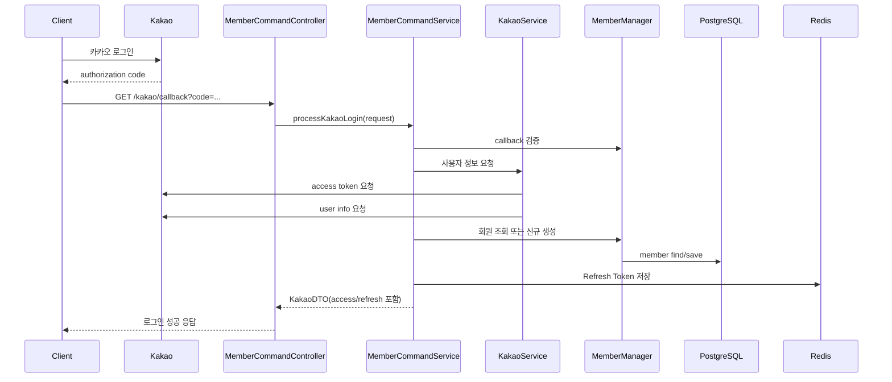

### 5-1-2. 내부 동작 설명

1. `/kakao/callback`이 호출되면 `MemberCommandServiceImpl.processKakaoLogin`이 시작됩니다.
2. 요청에서 `code`를 추출하고, `KakaoServiceImpl`이 실제 카카오 API 호출을 수행합니다.
3. `KakaoApiHelperImpl`이
   - 토큰 endpoint로 access token 요청
   - 사용자 정보 endpoint로 프로필 조회
   를 순차적으로 수행합니다.
4. `MemberManager`는 이메일 기준으로 회원을 찾고, 없으면 신규 회원을 생성합니다.
5. `TokenServiceImpl`이 Access Token과 Refresh Token을 발급합니다.
6. Refresh Token은 Redis에 저장됩니다.
7. 최종적으로 `KakaoDTO`에 access / refresh token을 담아 반환합니다.

### 5-1-3. 인증된 요청이 처리되는 방식

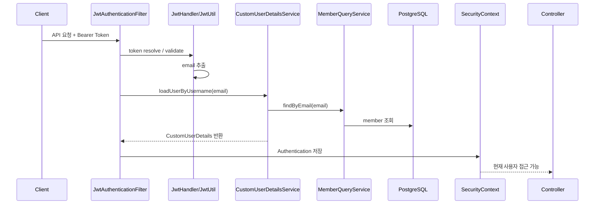

### 5-1-4. `/member/me` 동작

`/member/me`는 단순 회원 row 조회가 아닙니다.  
회원 기본 정보 + 등번호 + 슛 통계 + 하이라이트 개수를 조합해 응답합니다.

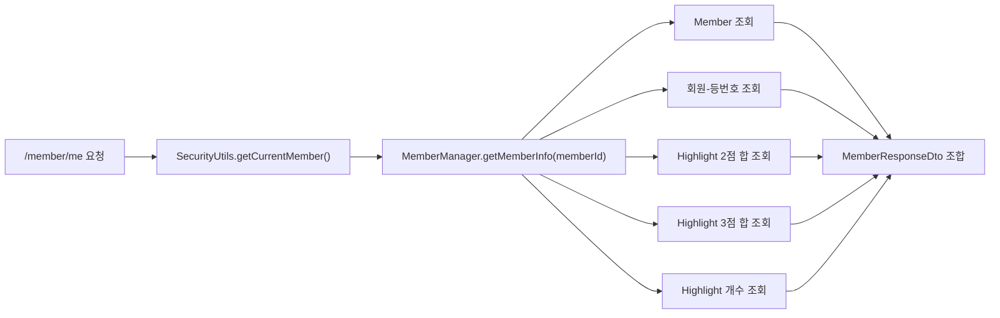

### 5-1-5. 회원 탈퇴와 집계 동의

- 회원 탈퇴
  - 현재 인증된 회원인지 검증
  - DB에서 회원 삭제
  - Redis Refresh Token 삭제
- 집계 동의
  - `Member.agree()` 도메인 메서드 호출
  - 이미 동의했다면 예외 처리

즉, 단순 flag 수정이 아니라 도메인 상태 변경으로 취급합니다.

## 🏷️ 5-2. 등번호 등록

### 관련 API

| Method | Endpoint | 인증 | 설명 |
| --- | --- | --- | --- |
| POST | `/api/backNumber` | 사용자 JWT | 등번호와 등번호 이미지 등록 |

### 5-2-1. 등번호 등록 흐름

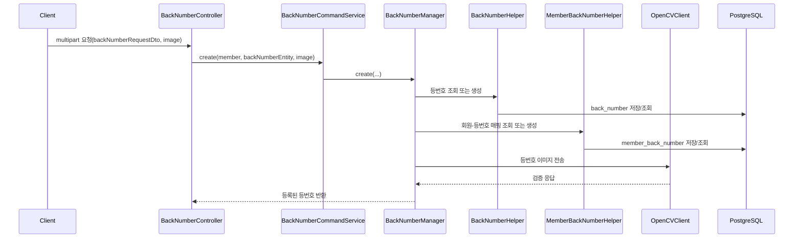

### 5-2-2. 핵심 포인트

1. 등번호 자체는 `back_number` 마스터 테이블에서 관리합니다.
2. 사용자와 등번호의 관계는 `member_back_number` 테이블로 분리합니다.
3. 즉, "등번호 값"과 "누가 그 등번호를 쓰는가"를 분리한 구조입니다.
4. 마지막 단계에서 OpenCV 서버에 등번호 이미지와 등번호 값을 함께 전달해 이후 개인 하이라이트 생성의 기준 정보를 만듭니다.

### 5-2-3. OpenCV 호출 방식

`OpenCVClientImpl.sendBackNumberInformation`은 아래 방식으로 동작합니다.

- multipart/form-data POST
- 헤더에 `X-Member-Id` 전달
- body에 `image`, `backNumber` 포함
- 최대 15초 timeout
- `IOException`, `TimeoutException`, `WebClientRequestException` 계열은 재시도
- 응답이 실패거나 등번호가 일치하지 않으면 예외 처리

즉, 단순 외부 API 호출이 아니라 네트워크 오류와 도메인 오류를 구분해서 다룹니다.

## 🔑 5-3. 업로드용 Pre-signed URL 발급

### 관련 API

| Method | Endpoint | 인증 | 설명 |
| --- | --- | --- | --- |
| POST | `/api/pre-signed` | 사용자 JWT | OpenCV 업로드용 서명 URL 발급 |

### 5-3-1. 왜 이 기능이 필요한가

클라이언트가 임의로 OpenCV 업로드 endpoint에 바로 파일을 던지면 다음 문제가 생깁니다.

- 누가 어떤 권한으로 업로드하는지 백엔드가 통제하기 어렵다.
- 업로드 작업과 사용자/작업 ID 매핑을 추적하기 어렵다.
- 진행률 구독과 결과 조회를 job 단위로 연결하기 어렵다.

그래서 업로드 전 단계에서 백엔드가 "짧은 수명의 업로드 권한"을 발급합니다.

### 5-3-2. 발급 흐름

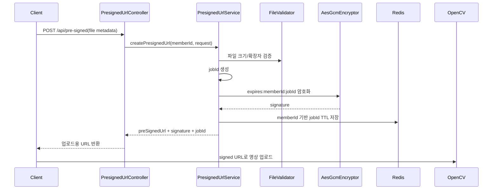

### 5-3-3. 내부 동작 설명

1. 요청이 오면 `SecurityUtils`로 현재 회원 ID를 구합니다.
2. `PresignedUrlService`는 난수 기반 `jobId`를 생성합니다.
3. 만료 시각과 `memberId`, `jobId`를 하나의 문자열로 묶습니다.
4. `AesGcmEncryptor`가 이 문자열을 AES-GCM으로 암호화합니다.
5. 암호문을 query parameter로 넣은 OpenCV 업로드 URL을 만듭니다.
6. 같은 시점에 Redis에 `memberId -> jobId`를 TTL과 함께 저장합니다.
7. 클라이언트는 이 URL로 직접 업로드하고, 이후 같은 `jobId`로 진행률과 결과를 조회합니다.

### 5-3-4. 보안 포인트

- 서명 원문: `expires:memberId:jobId`
- 암호화 방식: AES-GCM
- IV는 매 요청마다 랜덤 생성
- 결과는 URL-safe Base64 문자열
- 파일 메타데이터는 사전 검증
  - 확장자: `.mp4`
  - 크기: 설정값 기반 제한

즉, 단순 토큰 문자열이 아니라 "만료 시간과 사용자/작업 식별자를 묶은 서명"을 발급합니다.

### 5-3-5. 내부 데이터 구조

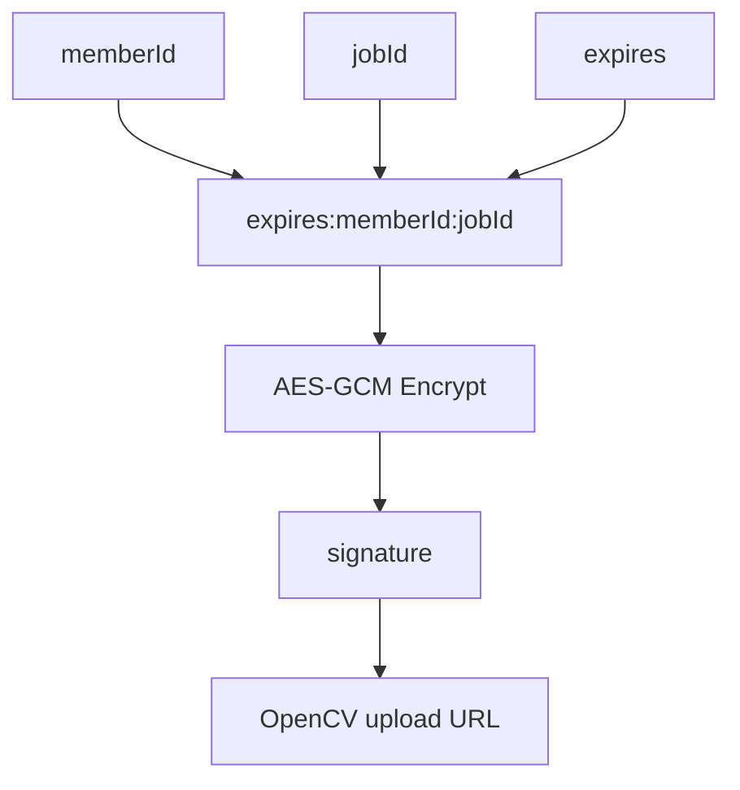

## 📡 5-4. 진행률 스트리밍과 하이라이트 결과 수신

### 관련 API

| Method | Endpoint | 인증 | 설명 |
| --- | --- | --- | --- |
| GET | `/api/progress/subscribe?jobId=...` | 사용자 JWT | SSE 구독 |
| GET | `/api/progress?jobId=...` | 사용자 JWT | 최신 진행률 polling 조회 |
| POST | `/api/highlight/upload-result` | OpenCV 시스템 호출 | 완성된 하이라이트 결과 저장 |

### 5-4-1. 실시간 진행률 흐름

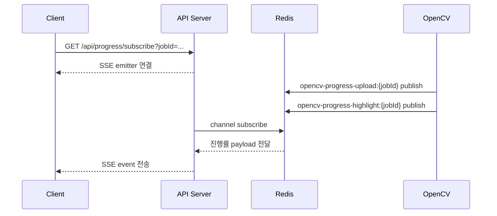

### 5-4-2. 내부 컴포넌트 흐름

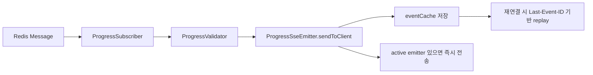

### 5-4-3. 왜 SSE를 선택했는가

이 기능은 클라이언트가 업로드와 하이라이트 생성 상태를 계속 확인해야 합니다.  
Polling만 사용하면 불필요한 요청 수가 증가합니다.

그래서 이 프로젝트는 다음 두 경로를 모두 제공합니다.

- 기본 경로: SSE
- fallback 경로: `/api/progress?jobId=...`

즉, 실시간성은 SSE로 확보하고, 클라이언트 제약이 있는 경우 polling으로도 대응합니다.

### 5-4-4. `ProgressSseEmitter`의 역할

이 컴포넌트는 단순 emitter 저장소가 아닙니다.

- `memberId:jobId` 조합으로 emitter 관리
- 최근 이벤트를 deque에 캐시
- `Last-Event-ID`가 오면 누락 이벤트 replay
- TTL 이후 오래된 이벤트 정리
- 최신 진행률을 별도 map에 저장해 polling fallback 지원

즉, "지금 연결된 사용자에게만 보내기"가 아니라 "잠깐 끊겼다가 다시 연결된 사용자도 놓치지 않도록" 설계했습니다.

### 5-4-5. OpenCV 결과 저장 흐름

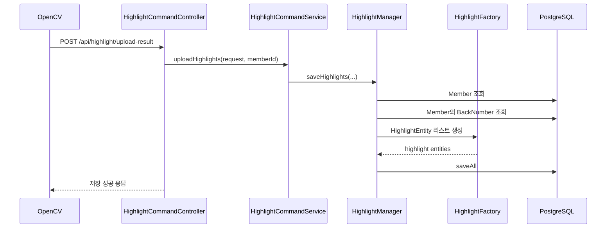

### 5-4-6. 하이라이트 저장 시 함께 보존하는 데이터

하이라이트는 단순 URL 저장이 아닙니다.

- `highlightId`
- `highlightURL`
- `highlightKey`
- `member`
- `backNumber`
- `twoPointCount`
- `threePointCount`
- `videoCreatedAt`
- `jobId`

이 정보가 있어야 나중에

- 마이페이지 통계
- 게시글 연결
- 캘린더 조회
- 랭킹 계산

까지 확장할 수 있습니다.

## 🎞️ 5-5. 하이라이트 조회 기능

### 관련 API

| Method | Endpoint | 인증 | 설명 |
| --- | --- | --- | --- |
| GET | `/api/highlight/list?page=&size=` | 사용자 JWT | 내 하이라이트 페이징 조회 |
| GET | `/api/highlight?period=WEEKLY|MONTHLY` | 사용자 JWT | 이번 주/이번 달 인기 하이라이트 |
| GET | `/api/highlight/calendar?year=&month=` | 사용자 JWT | 월별 캘린더 조회 |
| GET | `/api/highlight/latest?jobId=` | 사용자 JWT | 특정 job의 최신 결과 조회 |

### 5-5-1. 조회 기능별 흐름

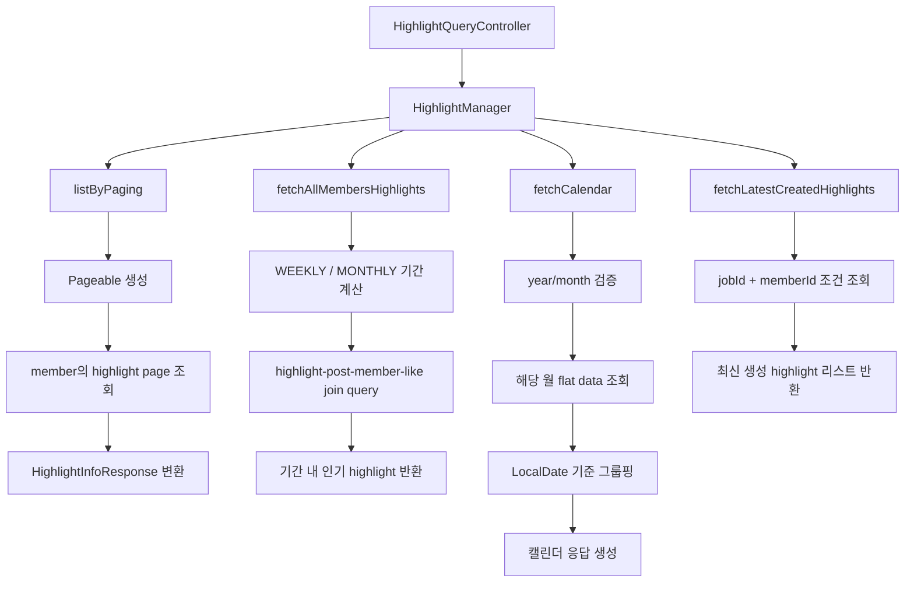

### 5-5-2. `/api/highlight/list`

이 API는 로그인 사용자의 하이라이트를 페이징으로 반환합니다.

- `PageRequest.of(page, size)` 생성
- 회원 기준 highlight page 조회
- `HighlightInfoResponse`로 매핑

즉, "내 하이라이트 목록" 기능의 기본 API입니다.

### 5-5-3. `/api/highlight?period=...`

이 API는 단순히 highlight만 보는 것이 아니라,
`highlight + post + member + like`를 join해서 "기간 동안 인기 있었던 하이라이트"를 반환합니다.

정확히는 다음 의미를 가집니다.

- 집계 기간: 이번 주 또는 이번 달
- 조건: 해당 기간 동안 눌린 좋아요
- 결과: 좋아요 수 기준 상위 하이라이트

즉, "많이 본 영상"이 아니라 "좋아요 활동이 많이 붙은 하이라이트"를 보여줍니다.

### 5-5-4. `/api/highlight/calendar`

이 API는 월간 캘린더 UI를 위한 API입니다.

동작 방식은 다음과 같습니다.

1. 연도와 월이 유효한지 검증
2. 해당 월의 시작 / 종료 시각 계산
3. 그 기간의 highlight를 flat list로 조회
4. `LocalDate` 단위로 그룹핑
5. 날짜별 개수와 상세 리스트를 묶어 응답

즉, DB에서 바로 달력 구조를 만들지 않고, flat query 후 애플리케이션 레벨에서 날짜 단위로 묶어 응답합니다.

### 5-5-5. `/api/highlight/latest`

이 API는 `jobId` 단위 결과 확인용입니다.

- OpenCV가 작업을 끝낸 직후
- 클라이언트가 방금 생성된 결과만 따로 보고 싶을 때

사용합니다.

즉, 전체 highlight 목록을 다시 뒤지는 대신 "이번 작업 결과"만 빠르게 꺼낼 수 있습니다.

## 📝 5-6. 커뮤니티: 게시글 / 댓글

### 게시글 관련 API

| Method | Endpoint | 인증 | 설명 |
| --- | --- | --- | --- |
| POST | `/api/post` | 사용자 JWT | 게시글 생성 |
| PUT | `/api/post/{postId}` | 사용자 JWT | 게시글 수정 |
| DELETE | `/api/post/{postId}` | 사용자 JWT | 게시글 삭제 |
| GET | `/api/post/{postId}` | 사용자 JWT | 게시글 단건 조회 |
| GET | `/api/post` | 사용자 JWT | 최신순/인기순 목록 조회 |
| GET | `/api/post/mypage` | 사용자 JWT | 내가 작성한 게시글 |
| GET | `/api/post/my/like` | 사용자 JWT | 내가 좋아요한 게시글 |

### 댓글 관련 API

| Method | Endpoint | 인증 | 설명 |
| --- | --- | --- | --- |
| POST | `/api/comment` | 사용자 JWT | 댓글 작성 |
| PATCH | `/api/comment/{commentId}` | 사용자 JWT | 댓글 수정 |
| DELETE | `/api/comment/{commentId}` | 사용자 JWT | 댓글 삭제 |
| GET | `/api/comment/{postId}` | 사용자 JWT | 게시글별 댓글 조회 |

### 5-6-1. 게시글 생성 흐름

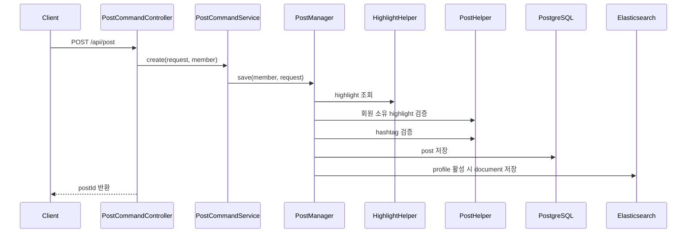

### 5-6-2. 게시글 생성 시 검증하는 것

`PostManager.save`는 아래 순서를 가집니다.

1. 요청 highlight 조회
2. 이 highlight가 현재 사용자 소유인지 검증
3. 해시태그가 유효한지 검증
4. PostEntity 저장
5. Elasticsearch가 활성화된 경우 document 저장

즉, 게시글은 독립 콘텐츠가 아니라 "내 하이라이트를 첨부한 콘텐츠"로 설계되어 있습니다.

### 5-6-3. 게시글 수정과 삭제

- 수정
  - 게시글 존재 확인
  - 게시글 소유자 검증
  - 새 highlight 검증
  - hashtag 검증
  - update
- 삭제
  - 게시글 존재 확인
  - 게시글 소유자 검증
  - soft delete

게시글 삭제는 물리 삭제가 아니라 논리 삭제입니다.

### 5-6-4. 게시글 조회

`/api/post`

- `type=latest`면 최신순 조회
- `type=popular`면 인기순 조회
- slice / no-offset 방식으로 다음 페이지를 가져오려는 구조

`/api/post/mypage`

- 내가 작성한 post id 목록을 먼저 조회
- 필요한 post를 다시 fetch join으로 조회
- DTO 변환 후 반환

`/api/post/my/like`

- 내가 좋아요 누른 게시글을 like 생성 시간 순으로 조회

### 5-6-5. 댓글 처리

댓글은 게시글보다 단순하지만, 아래 규칙이 명확합니다.

- 작성 시: 게시글 존재 확인 후 저장
- 수정 시: 댓글 작성자만 수정 가능
- 삭제 시: 댓글 작성자만 삭제 가능
- 삭제는 soft delete 방식

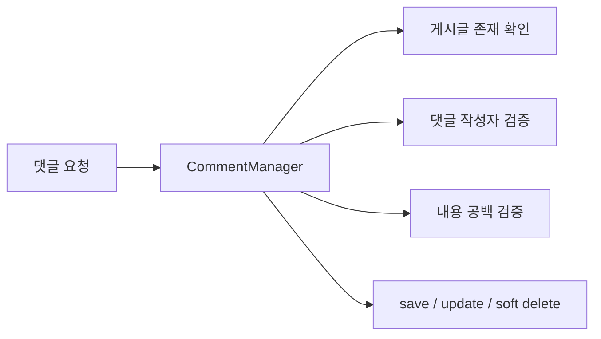

## 🔎 5-7. 검색과 자동완성

### 관련 API

| Method | Endpoint | 인증 | 설명 |
| --- | --- | --- | --- |
| GET | `/api/post/list?search=` | 사용자 JWT | DB 기반 검색 |
| GET | `/api/post/list-elastic?search=` | 사용자 JWT | Elasticsearch 기반 검색 |
| GET | `/api/post/suggest?keyword=` | 사용자 JWT | 자동완성 |

### 5-7-1. 검색 설계 포인트

이 프로젝트는 검색을 2단계로 나눴습니다.

- 기본 검색: DB LIKE 검색
- 고급 검색: Elasticsearch 검색

그리고 Elasticsearch가 비활성화된 환경도 고려해서 fallback을 넣었습니다.

### 5-7-2. 검색 분기 흐름

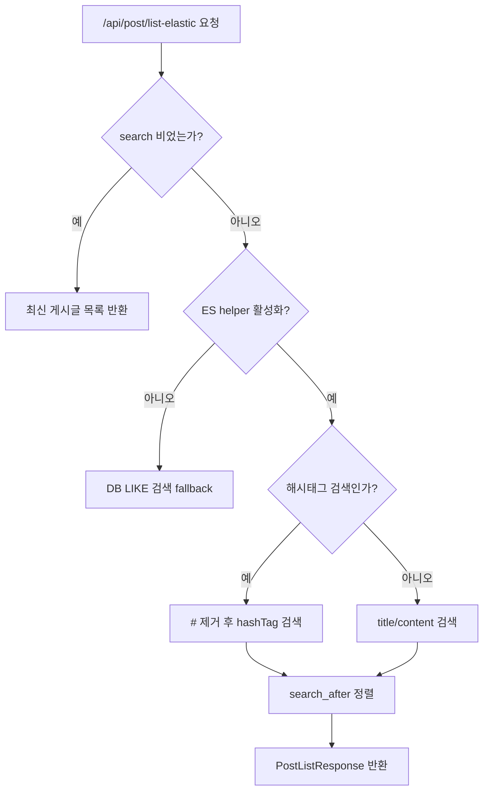

### 5-7-3. 일반 검색

DB 기반 `/api/post/list`

- `title LIKE %search%`
- `content LIKE %search%`
- `post_id < lastPostId`
- `ORDER BY post_id DESC`

즉, 최신순으로 잘라 가져오는 전형적인 no-offset 패턴입니다.

### 5-7-4. Elasticsearch 검색

Elasticsearch 검색은 아래 전략을 사용합니다.

- title 가중치: `40`
- content 가중치: `10`
- 정렬 우선순위
  - `_score DESC`
  - `likeCnt DESC`
  - `postId DESC`
- 페이지네이션
  - `search_after`

즉, 단순 full-text 검색이 아니라 "제목을 더 중요하게 보고, 동점이면 좋아요 수와 최신성으로 정렬"하는 전략입니다.

### 5-7-5. 해시태그 검색

검색어가 `#`로 시작하면 일반 검색어가 아니라 해시태그로 해석합니다.

예시:

- `#2점슛`
- `#블락`

동작 방식:

1. 맨 앞 `#` 제거
2. 공백 제거
3. `hashTag` 필드 기준 검색

### 5-7-6. 자동완성

자동완성도 일반 검색과 해시태그 검색을 분리합니다.

- 일반 검색어
  - `title.keyword` prefix 기반 자동완성
- 해시태그 검색어
  - `hashTag` prefix 기반 자동완성
  - 중복 제거 후 최대 5개

즉, 게시글 제목 자동완성과 해시태그 자동완성을 같은 API 안에서 분기 처리합니다.

## ❤️ 5-8. 좋아요와 동시성 제어

### 관련 API

| Method | Endpoint | 인증 | 설명 |
| --- | --- | --- | --- |
| POST | `/api/like/{postId}` | 사용자 JWT | 좋아요 등록 |
| DELETE | `/api/like/{postId}` | 사용자 JWT | 좋아요 취소 |

### 5-8-1. 왜 동시성 제어가 중요한가

좋아요는 아래 2개를 동시에 맞춰야 합니다.

- `like_table` row 정합성
- `post.like_cnt` 집계 정합성

여러 사용자가 같은 게시글을 동시에 누르면 race condition이 쉽게 발생합니다.

### 5-8-2. 최종 선택한 방식

최종 구현은 게시글 row를 비관적 락으로 조회하는 방식입니다.

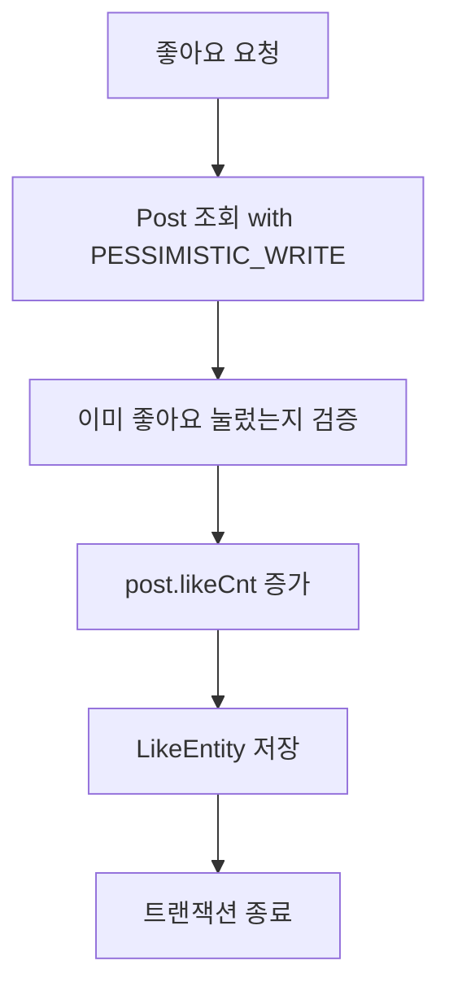

취소는 역순입니다.

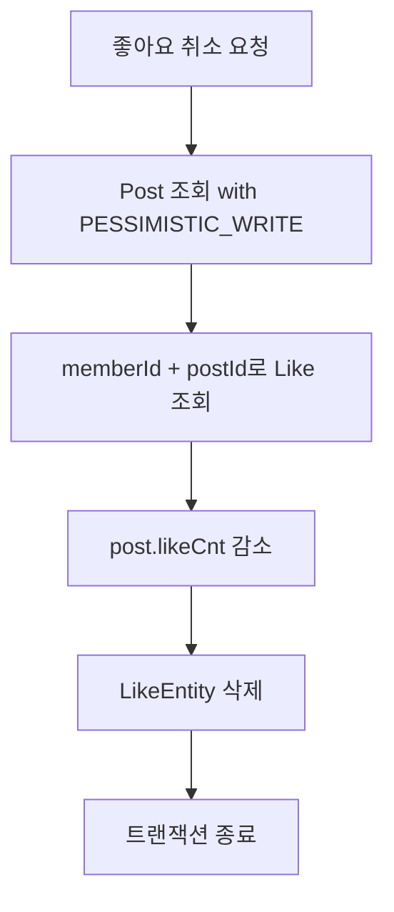

### 5-8-3. 내부 동작 설명

`LikeManager.increase`

1. 게시글을 비관적 락으로 조회
2. 같은 사용자가 이미 좋아요 눌렀는지 확인
3. `post.increase()`
4. Like row 저장

`LikeManager.decrease`

1. 게시글을 비관적 락으로 조회
2. Like row 조회
3. `post.deleteLike()`
4. Like row 삭제

### 5-8-4. 테스트 관점에서 의미 있는 부분

`LikeManagerConcurrencyTest`에는 다음 시나리오가 있습니다.

- 동시에 100건 좋아요 증가
- 동시에 1,000건 좋아요 증가
- 동시에 10,000건 좋아요 증가
- 동시에 100건 좋아요 감소
- 동시에 1,000건 좋아요 감소
- 동시에 10,000건 좋아요 감소

그리고 테스트 코드에는 실험 흔적도 남아 있습니다.

- 증분 쿼리 방식 실험
- Atomic 방식 실험
- Optimistic Lock 실험
- Distributed Lock 실험

즉, 여러 대안을 비교해 본 뒤 현재 구조에서는 비관적 락이 가장 단순하고 명확한 선택이었다는 점을 보여줍니다.

## 🏆 5-9. 랭킹

### 관련 API

| Method | Endpoint | 설명 |
| --- | --- | --- |
| GET | `/api/rank/last-week?date=` | 지난 주 랭킹 조회 |
| GET | `/api/rank/last-month?date=` | 지난 달 랭킹 조회 |
| GET | `/api/rank/this-week` | 이번 주 랭킹 조회 |
| GET | `/api/rank/this-month` | 이번 달 랭킹 조회 |

### 5-9-1. 랭킹을 두 종류로 나눈 이유

랭킹은 성격이 다른 2가지를 모두 처리해야 합니다.

- "지금 진행 중인 랭킹"
- "이미 종료된 기간의 랭킹"

이 둘은 조회 전략이 다릅니다.

### 5-9-2. 현재 랭킹 조회 흐름

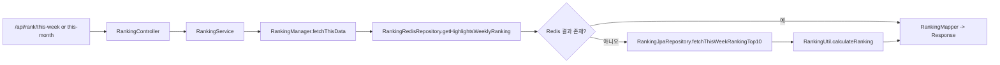

### 5-9-3. 과거 랭킹 조회 흐름

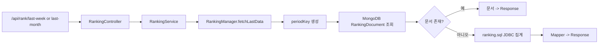

### 5-9-4. 점수 산정 방식

랭킹은 단순 총점만 보지 않습니다.

- 총점 우선
- 동점이면 3점슛 우선
- 다시 동점이면 2점슛 우선

Redis 쪽에서는 이를 위해 가중치 score를 사용합니다.

```text
score = totalScore * 1_000_000
      + threeScore * 1_000
      + twoScore
```

즉, total > three > two 우선순위가 자연스럽게 유지되도록 설계했습니다.

### 5-9-5. 현재 랭킹 저장 구조

현재 주간/월간 랭킹은 Redis ZSet을 사용합니다.

- 동일 회원이 다시 반영되면 기존 값을 제거 후 재삽입
- 조회는 `reverseRangeWithScores`로 top 10
- 주간 / 월간 키는 서로 분리

### 5-9-6. 과거 랭킹 저장 구조

과거 랭킹은 MongoDB `ranking` 컬렉션 문서로 저장합니다.

- `type`
- `periodBegin`
- `typePeriodKey`
- `top10`

즉, 과거 랭킹은 "결과 스냅샷"으로 다루고, 현재 랭킹은 "실시간 가변 상태"로 다룹니다.

### 5-9-7. 스케줄러

```mermaid
flowchart TD
    A["주간/월간 스케줄"] --> B["RankingRedisScheduler"]
    B --> C["Redis 현재 랭킹 초기화"]

    D["일간/주간/월간 배치 스케줄"] --> E["RankingBatchScheduler"]
    E --> F["Spring Batch JobLauncher"]
    F --> G["랭킹 스냅샷 저장 구조"]
```

### 5-9-8. 배치 서버 상태

`apps/batch-server` 아래에는 다음 코드가 분리되어 있습니다.

- Reader
- Processor
- Writer
- Listener
- Validator
- Scheduler

즉, API 서버에서 랭킹 집계를 떼어내 별도 배치 서버로 분리하려는 구조가 설계되어 있습니다.

다만 현재 워크트리 기준으로는 일부 Batch config 코드가 주석 처리된 상태라,
"배치 구조와 골격은 존재하지만 정비 중"으로 보는 것이 가장 정확합니다.

<a id="data-model"></a>
## 🗃️ 6. 데이터 모델

### 6-1. 핵심 ERD


### 6-2. 엔티티별 의미

| 엔티티 | 의미 |
| --- | --- |
| Member | 서비스 사용자. 이름/이메일은 암호화 저장, 집계 동의 여부 포함 |
| BackNumberEntity | 등번호 마스터 |
| MemberBackNumberEntity | 회원과 등번호의 매핑 |
| HighlightEntity | OpenCV가 생성한 개인 하이라이트 단위 |
| PostEntity | 하이라이트를 첨부한 커뮤니티 게시글 |
| Comment | 게시글 댓글 |
| LikeEntity | 게시글 좋아요 |
| RankingDocument | MongoDB에 저장되는 기간별 랭킹 스냅샷 |

### 6-3. 데이터 설계 포인트

- 게시글과 댓글은 soft delete
- 하이라이트는 게시글과 1:N 유사 관계로 재사용 가능
- Member는 BackNumber와 직접 결합하지 않고 브릿지 테이블 사용
- Ranking은 운영 테이블에 매번 집계하지 않고 문서 스냅샷 보존

<a id="operations"></a>
## ⚙️ 7. 운영 / 배포 / CI

### 7-1. Docker Compose 구성

현재 `docker-compose.yml`은 아래 서비스를 함께 올릴 수 있게 구성되어 있습니다.

- PostgreSQL
- MongoDB
- Elasticsearch
- Kibana
- API Server
- Batch Server

### 7-2. 운영 컨테이너 구성

```mermaid
flowchart LR
    A["docker-compose"] --> B["postgres"]
    A --> C["mongo"]
    A --> D["elasticsearch"]
    A --> E["kibana"]
    A --> F["api-server"]
    A --> G["batch-server"]

    F --> B
    F --> C
    F --> D
    F --> G
```

### 7-3. Jenkins 배포 파이프라인

```mermaid
flowchart TD
    A["Jenkins Job 시작"] --> B["Git clone"]
    B --> C["비공개 application / env 파일 주입"]
    C --> D["기존 컨테이너 및 포트 정리"]
    D --> E["Elasticsearch 볼륨 권한 수정"]
    E --> F["docker-compose up -d --build"]
    F --> G["API / DB / ES / Mongo 컨테이너 기동"]
```

### 7-4. Jenkinsfile에서 실제로 하는 일

1. main 브랜치 clone
2. credential로 비공개 설정 파일 복사
3. 기존 포트/컨테이너 cleanup
4. Elasticsearch data/log 권한 수정
5. `docker-compose up -d --build`

즉, 단순 jar 배포가 아니라 "여러 인프라 서비스와 앱 컨테이너를 함께 기동하는 배포"를 자동화했습니다.

<a id="testing"></a>
## ✅ 8. 테스트와 품질 관리

### 8-1. 테스트 범위


대표적으로 아래 영역이 테스트됩니다.

| 영역 | 예시 |
| --- | --- |
| 회원 | MemberManagerTest, MemberCommandControllerTest, KakaoApiHelperImplTest |
| 등번호 | BackNumberManagerTest, BackNumberControllerTest |
| 하이라이트 | HighlightManagerTest, HighlightQueryControllerTest, HighlightFactoryTest |
| 게시글 | PostManagerTest, PostCommandControllerTest, PostQueryControllerTest |
| 댓글 | CommentManagerTest, CommentCommandControllerTest |
| 좋아요 | LikeManagerTest, LikeManagerConcurrencyTest |
| 랭킹 | RankingManagerTest, RankingControllerTest, RankingRedisSchedulerTest |


### 8-2. 품질 관리 포인트

- 컨트롤러 / 비즈니스 / 리포지토리 테스트 분리
- 동시성 테스트 별도 작성
- Elasticsearch 연동 테스트 분리
- JaCoCo 리포트 생성 설정 관리


<a id="refactoring"></a>
## 🧱 9. 멀티모듈 리팩터링

### 9-1. 현재 레포지토리 상태

```text
.
├── apps
│   ├── api-server
│   └── batch-server
├── libs
│   ├── common
│   └── support
├── modules
│   ├── community-context
│   ├── global
│   ├── media-processing-context
│   └── member-context
└── src/main/java/com/midas/shootpointer
    ├── domain
    ├── global
    └── infrastructure
```

### 9-2. 왜 리팩터링을 시작했는가

기존 `src/main/java/com/midas/shootpointer` 구조는 기능이 늘수록 다음 문제가 생깁니다.

- 도메인 경계가 흐려짐
- 공통 코드가 여기저기 흩어짐
- API 서버와 배치 서버의 책임이 섞임
- 테스트와 배포 단위가 커짐

그래서 다음 방향으로 분리하고 있습니다.

- 진입점 분리: `api-server`, `batch-server`
- 컨텍스트 분리: `member-context`, `community-context`, `media-processing-context`
- 공통 라이브러리 추출: `libs/common`, `libs/support`

### 9-3. 리팩터링 목표 구조

```mermaid
flowchart LR
    A["Legacy src/main/java"] --> B["apps"]
    A --> C["modules"]
    A --> D["libs"]

    B --> B1["api-server"]
    B --> B2["batch-server"]

    C --> C1["member-context"]
    C --> C2["community-context"]
    C --> C3["media-processing-context"]
    C --> C4["global"]

    D --> D1["common"]
    D --> D2["support"]
```


